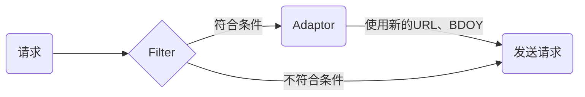

# 请求拦截

## install

```bash
npm i @swl/http-interceptor
```

## 设计



`Filter` 与 `Adaptor` 成对出现，满足过滤过滤器的条件后，使用对用的适配器修改 `URL`、`BDOY`

## Iterceptor 拦截器

定义拦截器的类型，支持的类型：

- XMLHttpRequest
- fetch
- window.navigator.sendBeacon
- new Image

## Filter 过滤器

当任一一个过滤器返回为 true 时，才会触发拦截器

## Adapter 适配器

用于修改报文，对 URL、Body 执行具体处理的地方

## 示例

```js
const {
  createBeaconInteceptor,
  createImageInterceptor,
  createXhrInterceptor,
  createFetchInterceptor,
} = HttpInterceptor;

const filter = (url, data) => {
  console.log(`call filter, url: ${url} data: ${JSON.stringify(data)}`);
  return true;
};
const adapter = (url, data) => {
  console.log(`call adapter, url: ${url} data: ${JSON.stringify(data)}`);
  return [url + "_adapter", data];
};

const interceptorList = [
  createBeaconInteceptor(),
  createImageInterceptor(),
  createXhrInterceptor(),
  createFetchInterceptor(),
];
for (const ins of interceptorList) {
  ins.addFilterAndAdapter(filter, adapter);
  ins.apply();
}

const formData = new FormData();
formData.append("name", "xxx");

const img = new Image();
img.src = "/server/img";

var xhr = new XMLHttpRequest();
xhr.open("POST", "/server/xhr", true);
xhr.setRequestHeader("Content-type", "application/x-www-form-urlencoded");
xhr.onload = function () {
  console.log("xhr onload");
};
xhr.send("ddd");

fetch("/server/fetch", {
  method: "post",
  body: formData,
});

window.navigator.sendBeacon("/server/beacon", formData);
```
